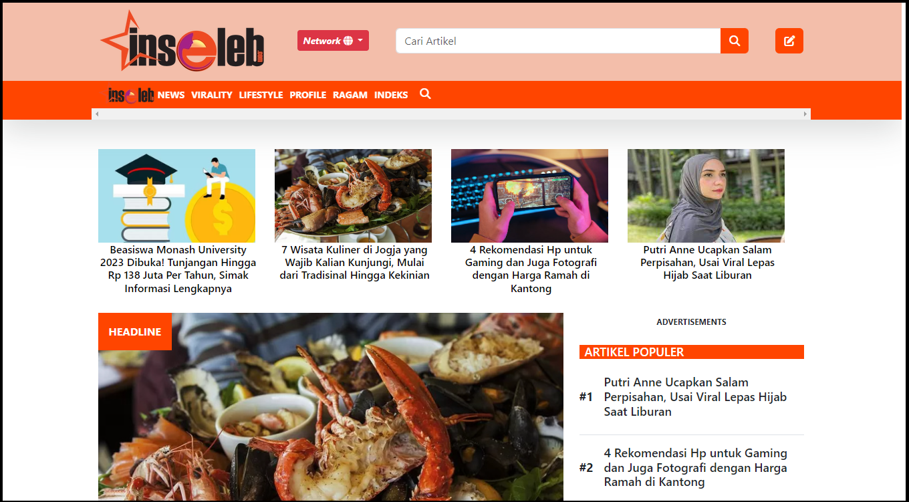

# Sistem Informasi Berita INSELEB

Sistem Informasi Berita Inseleb adalah platform yang dibangun untuk menyajikan informasi terkini tentang selebriti dan tokoh masyarakat, serta berita hiburan secara cepat dan akurat. Dengan menggunakan teknologi terbaru, sistem ini mengumpulkan, mengelola, dan menyajikan berita-berita terbaru seputar dunia hiburan kepada pengguna dengan antarmuka yang intuitif dan mudah digunakan.

## Fitur Utama:
- Informasi Berita : Pengguna dapat menjelajahi terkait berita terbaru, berita populer dan lainnya
- Kategori Berita: Pengguna dapat dengan mudah menjelajahi berbagai kategori berita seperti gosip terbaru, peristiwa industri hiburan, wawancara eksklusif, dan lainnya.
- Pencarian : Pengguna dapat melakukan pencarian lanjutan berdasarkan kata kunci atau kategori untuk menemukan berita yang sesuai dengan minat mereka.
- Pembuatan Laporan Pembayaran: Menghasilkan laporan pembayaran untuk pesanan pelanggan.
- Interaksi Pengguna: Pengguna dapat memberikan komentar, menandai berita favorit mereka, dan berbagi konten dengan mudah melalui platform media sosial
- Gabung Penulis: Pengguna dapat membuat akun sebagai penulis dan mengirimkan artikel yang mereka miliki.

### Design Sistem

